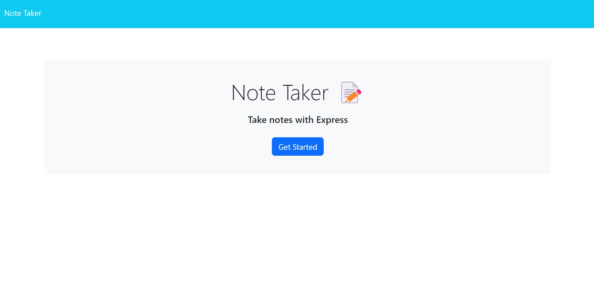
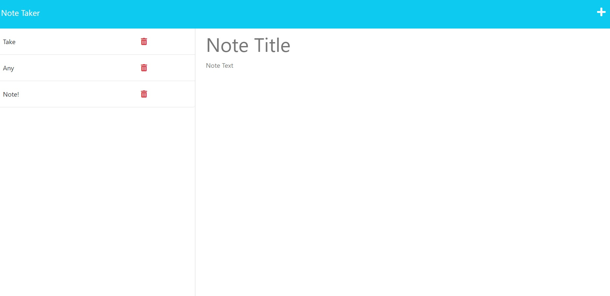

# Note Taker App
  ## Deployed App
  https://notetakeralastair.herokuapp.com/
  
  
  ## Table of Contents 
  - [Description](#description)
  - [Installation](#installation)
  - [Usage](#usage)
  - [Contributors](#contributors)
  - [Testing](#testing)
  - [Additional Info](#additional-info)
  - [Questions and Contribution instructions](#questions-and-contribution-instructions)
  ## Description:
  This application was created to demonstrate server GET,POST,DELETE requests and to also use data store.
  ## Installation:
  If you would like to clone the code. Please clone, use command npm i, use command npm start to host your own local version.
  ## Usage:
  Use this application to take, save and delete notes for any requirement!
  ## Contributors:
  Alastair Hatfield
  ## Testing:
  n/a
  ## Additional Info:
  - Github: [AlastairHafield](https://github.com/AlastairHafield)
  ## Questions and Contribution instructions: 
  Please contact this email address with any questions about the project or if you'd like to contribute!
  - Email: AlastairHatfield@live.com 
  ## Licensing:
  
